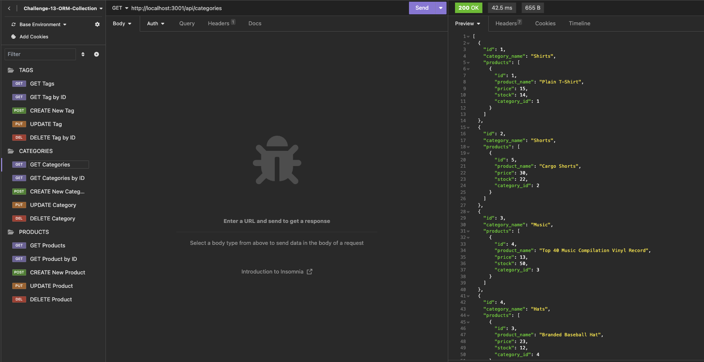
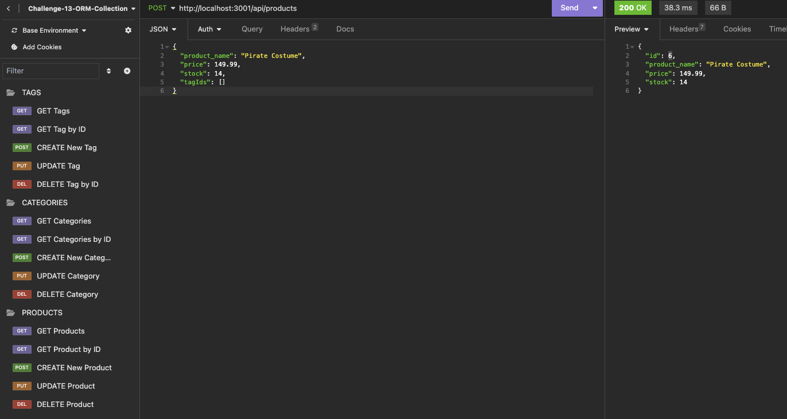

# E-Commerce Back-End Application 💻

## Description
The purpose of this project is to utilise Object-Relational Mapping (ORM) to build the back end for an e-commerce website. ORM used is Sequelize package installed via npm. MySQL2, dotenv and Express.js have also been used in the development of this application.

## Requirements
- Ensure MySQL username and password added to an environment variable file and then connected to database using Sequelize
- Ensure schema and seed commands create a development database with test data
- Ensure command to run application leads to server starting and Sequelize models syncing to the MySQL database
- API GET routes in Insomnia for categories, products or tags leads to data for each route being displayed and formatted in JSON
- When testing API POST, PUT and DELETE routes in Insomnia, can successfully create, update and delete data in database

## Insomnia Application Preview

## Submission Requirements
- [Video Walkthrough](https://drive.google.com/file/d/1HojOw4Z2VbN7SVO-KUty4XiVi3DY5Bwb/view)
- [GitHub Repo](https://github.com/ajayshans/ecommerce-backend)